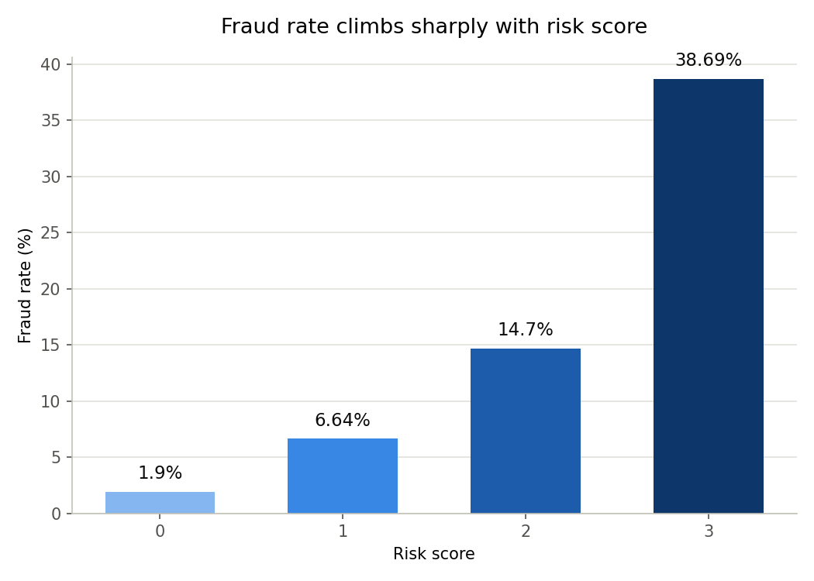

# Fraud & Trust Signal Analysis

A SQL-driven investigation into which signals in an e-commerce transaction ledger separate fraudulent activity from legitimate activity, and whether those signals can be combined into a single risk score.

## The data

[Fraudulent E-Commerce Transactions](https://www.kaggle.com/datasets/shriyashjagtap/fraudulent-e-commerce-transactions) (Version 1, Kaggle, by shriyashjagtap) — 1,472,952 transactions with 16 features including payment method, device used, IP address, shipping/billing address, account age, and transaction hour. About 5% of transactions are labeled fraudulent.

## Approach

The analysis runs entirely in SQL against a local SQLite database, using CTEs, window functions, and CASE-based bucketing:

1. **Exploration** (`sql/02_exploration.sql`) — baseline fraud rate, and a first pass checking whether payment method or account age relate to fraud.
2. **Risk investigation** (`sql/03_risk_queries.sql`) — targeted checks on shared IP addresses, transaction hour, and address mismatches.
3. **Risk scoring** (`sql/04_risk_score_view.sql`) — a combined risk score built from the signals that actually held up, tested against fraud rate.

A note on methodology: the original plan included a customer-level "spending anomaly" query (comparing each transaction to that customer's own average). Profiling revealed that `Customer ID` is generated fresh per transaction rather than representing a returning account — so that query was dropped in favor of IP-address-based checks, which can meaningfully repeat across transactions.

## Findings

**Overall fraud rate:** 5.01% across all 1,472,952 transactions.

| Signal | Result | Verdict |
|---|---|---|
| Payment method | 4.97%–5.04% across all four methods | No signal |
| Account age | 22.3% (under 30 days) vs. 3.1–3.5% (30+ days) | **Strong signal** — ~7x difference |
| Shared IP address | 4.98% (shared) vs. 5.01% (unique) | No signal (small sample: 602 of 1.47M txns) |
| Transaction hour | 10.2–10.5% (midnight–5am) vs. 3.1–3.2% (daytime) | **Strong signal** — ~3x difference |
| Shipping/billing mismatch | 4.98% (mismatch) vs. 5.02% (match) | No signal — runs counter to common assumption |

Three of the five signals tested showed no meaningful relationship to fraud, including two commonly assumed fraud indicators (payment method, address mismatch). The two signals that did hold up — account age and time of day — were combined into a single risk score.

## Risk score

Each transaction is scored using two validated signals: 2 points for an account under 30 days old, 1 point for a transaction between midnight and 5am.

| Risk score | Transactions | Fraud rate |
|---|---|---|
| 0 | 981,890 | 1.9% |
| 1 | 347,732 | 6.64% |
| 2 | 97,598 | 14.7% |
| 3 | 45,732 | 38.69% |

The score separates cleanly and monotonically — the highest-risk group is over 20x more likely to be fraudulent than the lowest.



## How to run

```bash
git clone https://github.com/corinnewestover/fraud-signal-analysis.git
cd fraud-signal-analysis
pip3 install -r requirements.txt
```

1. Download the dataset from [Kaggle](https://www.kaggle.com/datasets/shriyashjagtap/fraudulent-e-commerce-transactions) and place it at `data/fraud_transactions.csv`.
2. Load it into SQLite: `python3 load_data.py`
3. Run the queries in `sql/02_exploration.sql`, `sql/03_risk_queries.sql`, and `sql/04_risk_score_view.sql` in order, using [DB Browser for SQLite](https://sqlitebrowser.org/) or the `sqlite3` CLI.
4. Regenerate the chart: `python3 notebooks/plot_risk_score.py`

## Tools

SQLite, Python (pandas, matplotlib), DB Browser for SQLite

## Author
Corinne Westover — [LinkedIn](https://www.linkedin.com/in/corinne-westover/)
